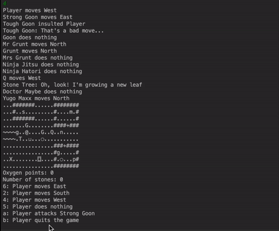

# FIT2099 OOP

The purpose of this assignment was to create a James Bond inspired rogue-like game that applies standard OOP principles. We worked in pairs and were required to collaborate using git. The code written in our game adheres to the UML diagrams created for this project. 

## Masterminds behind the game
- Alex O
- Hew Ye Zea (Jess)

## Gameplay
### Entities
#### Player ```@```

Well, that's you playing the game. (duh)

#### Enemies
- Grunt ```g```

The lowest in the hierarchy of enemies. It follows and slaps but is almost harmless.
- Goon ```G```

Grunt but angrier. It follows and shouts insults at the player. Its punches are x2 damage of Grunt's.
- Ninja ```n```

Sly and mysterious. It stays in one spot until it eyes the player from 5 boxes away. Then, with its stun powder, it stuns the player for a round. The player has nothing to do but wait for the powder to wear off. 
- Dr Maybe ```m```

Smart and cunning, he works in a locked room and has the rocket engine for the player to fly to the Moon. In order to retrieve the rocket engine, he needs to be defeated. The player has to kill one of the enemies to obtain the key and fight him. Fortunately, Dr Maybe is all brains but no strength. 1/2 of Grunt's damage == EZ KO.

#### Ultimate boss
- YugoMaxx ```y```

Located on the Moon, his thick exoskeleton makes him invincible to the player's attacks. There's only one thing that can stop him. H20 (yup, water) on Earth. Store it in your pistol and pew pew him to death. Once he's defeated, carry his dead carcass back to Earth to show everyone how much of a hero you are! 

#### Sidekick
- Q ```Q```

He's there to help but in order for him to help you, you need to give him the rocket plans in exchange for the rocket body. He has the ability to talk and wander around the map. 

### Objects
- Key 🔑 ```K```

Unlock doors.
- Spacesuit 👨‍🚀  ```s```

Needed for the player to transport to the Moon. It has an emergency sensor that transports the player back to Earth if they run out of O2. 
- Oxygen Tank ```o```

Collect O2 from the Oxygen dispenser so that you can breathe on the Moon.
- Rocket plans ```p```

Needed for Q to help you.
- Water pistol ```¬```

Bring justice and shoot YugoMaxx to death.

### Locations
- Rocket Pad ```X```

Place your rocket engine and rocket body to build a rocket and fly to the Moon! (Oh, but you need a spacesuit and O2 to fly)
- Oxygen Dispenser ```O```

Fill your Oxygen tanks with some good fresh air. (O2)

## Bonus Game
Wait, there's more!
We've added a special entity, called the StoneTree ```T```.
It talks and dispenses stones when the player waters it with a bucket ```⊔```. It's not generous though, there's only a 50% chance it'll give you a stone. But what can you do with stones? 

🎉 Redeem items to help you win in the game 🎉
- 2 stones = Redeem a ticket for intra-world teleportation. Lazy to kill enemies for the key? Stand on the teleportation pad ```◌``` for a 2-way travel. 
- 3 stones = Fertilizer to level up the StoneTree to spawn x2 stones.
- 4 stones = A weapon with higher damage to fight all your enemies.



Game engine by Dr. David Squire.

We scored 59/60 for this assignment.
